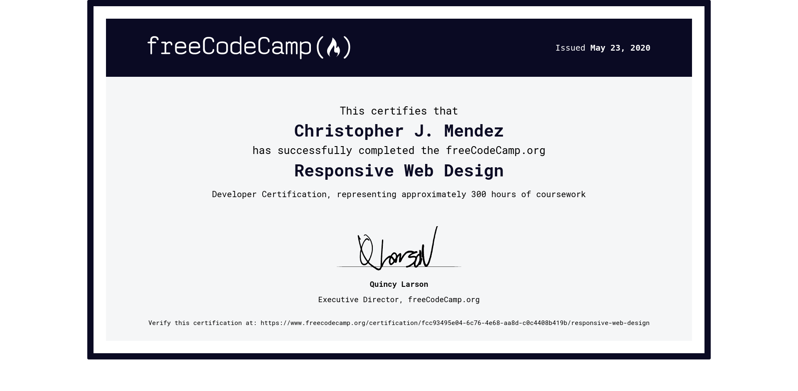

# 100 Days of Code

### Day 1: May 20, 2020

First time journaling my coding journey. Today, I started the last project of freeCodeCamp's Responsive Web Design Section: [building a personal portfolio website.] (https://www.freecodecamp.org/learn/responsive-web-design/responsive-web-design-projects/build-a-personal-portfolio-webpage)

Did about an hour of coding today and established the file structure and overall layout of my personal portfolio. Nothing fancy so far. 

### Day 2: May 21, 2020

Worked on the personal portfolio project for freeCodeCamp quite a bit today. Built the sticky navbar, landing page, projects sections, and contact/footer section. All on one HTML page. I used CSS Grid to develop the overall layout and it worked pretty well. Honestly, I'm surprised at how versatile CSS Grid is. I initially thought it was another way to align items like Flexbox, which it can do, but being able to create layouts with `grid-template-columns/rows` allows for much greater freedom and power than something like Flexbox. Almost done with the website, just need to add my projects in and make it responsive for mobile. 

### Day 3: May 22, 2020

Today, I finished freeCodeCamp's Responsive Web Design curriculum and received a certificate of completion. 

I first started freeCodeCamp on February 28, 2019 and almost one year later, I finally finished their responsive web design portion. However, I know that this past year, I haven't been diligent at all in learning front-end web development. I was always interested in front-end web development, but I never start learning about it because I was afraid to start. There are just so many technologies and paths out there about this career field, so I was intimated and scared about just starting. Then, in my junior year of college, I took a course titled "Intro to Coding for Journalists." It was an awesome course and it was what I needed to ignite my spark, my motivation to self-learn front-end web development. 

So yeah, around the time I was taking this course in college, I started freeCodeCamp. I breezed through the tutorials, but when it came time to complete the actual projects, I had **no idea** what I was doing. While I was looking at the HTML file on Chrome, I was wondering why my content, my code wasn't working the way I wanted it to. That's when I realized that my problem stemmed from the course I took in college which taught exclusively with Bootstrap. Everything I knew about front-end web development was from Bootstrap. I didn't know how to center in CSS, how to use Flexbox or CSS Grid, SASS, a lot of core front-end web development skills were just completely foreign to me. Therefore, I had to start over and learn from scratch. I had to learn front-end web development from the ground up. After countless udemy  (thanks Brad & Jonas!) and YouTube tutorials, I finally have a good grasp of HTML, CSS, SASS, BEM, and responsive web design. 

It's been a long road, but my front-end web development career is only just starting. Tomorow, I finally start learning and messing around with JavaScript. Am I nervous? For sure. Am I excited to get started? You bet. 

### Day 4: May 23, 2020

I graduated from UT Austin today, virtually of course. Anyways, I updated my portfolio website today with the template. It's looking pretty good actually, very mobile-responsive too. Finally, I started Wes Bos Beginner JavaScript course. Let's see how it goes. (P.S. I uninstalled pop os and moved back to windows on my main laptop)

### Day 5: May 27, 2020

Haven't updated my progress in a while. I can assure you that I did code these past few days, but I never wrote about my progress and that's something that I want to improve upon. I feel that writing down my progress is important because then I can look back and see how far I've come and what I've done so far. For instance, I look back these few days and try to remember what exactly I did, but I just can't remember. I believe that I tutorial-hopped between different JavaScript courses such as Andrew Mead's Modern JS Bootcamp, Wes Bos JS for Beginners, and even purchased a new course on Udemy from Colt Steele! Realizing that I was getting nowhere, I refunded the udemy course, and stuck to the JS curriculum on freeCodeCamp. Currently, I am learning basic JavaScript syntax. I started this section yesterday and went through a good 75% of the curriculum. Tomorrow, I hope to finish the section and start the ES6 portion of the JavaScript curriculum. 

### Day 6: May 28, 2020

Almost finished the basic JavaScript syntax section on freeCodeCamp (99/100). **NEWSFLASH**: Learning JavaScript is hard! One of the curriculum's practice exercises took me the better half of today to complete. It was very confusing, but I thought through the brief and eventually was able to solve it without help. Then, I googled the problem and watched how others solved it on YouTube. One guy was able to solve it in way less lines of code than me, but that's great because I was able to learn from his code-along. Now, I'm stuck at a recursion problem which I'll tackle tomorrow or maybe later tonight. Not feeling so good now that the difficulty has ramped up. I keep thinking, 'maybe I'm not cut out for this." Regardless, I'm going to keep pushing, learning, and practicing. That's the only way I'm going to get good and hopefully break through this imposter syndrome. After all, I know that my career goal is to land a job as a front-end web developer. Going to take a break for now.

### Day 7: May 29, 2020

Wow, on my last challenge for freeCodeCamp's Basic JavaScript curriculum. It's been a crazy journey, but the difficulty in their challenges for learning JavaScript has been ramping up! So far, I'm stuck on recursion. Almost done, going to review a video on YouTube about recursion and tackle the challenge tomorrow. Tomorrow, I will finish this section and move on to learning ES6. 

### Day 8: May 30, 2020

Today, I finished JavaScript basics on freeCodeCamp. I was a bit disappointed because I was able to do the whole section without looking up the answer (ok, I did look up hints for recursion, but that's because recursion!), but I just couldn't wrap my head around the last challenge. Now, I'm learning ES6 and I'm on 16/31, basically 50% of the way. Going to continue my progress tomorrow. 

### Day 9: May 31, 2020

Today, I finished the ES6 section of freeCodeCamp's JavaScript section. It wasn't so bad, but there are some things that I need to review, such as destructuring, modules, promises, and many more abstract terms. But, I'm making progress and tomorrow I began their regular expressions curriculum which I'm pretty nervous about... Last Day of May!!

### Day 10: June 1, 2020

Finished regular expressions section of JavaScript. It was very confusing, but I learned how powerful regex can be to help parse data and strings. Tomorrow, I start to learn about debugging, and hopefully, start the data structures section of FCC. 

### Day 11: June 2, 2020

Finished the JavaScript debugging & data structures sections of freeCodeCamp. A lot of the stuff in the sections we learned in previous sections, like adding, deleting, and modifying arrays, objects, and utilizing console.log to find bugs and errors (which I use all the time when my code doesn't work the way I want it to!). Now, I'm working through their algorithm section. I've only started, but it's tough and I feel that this is going to take a lot longer than a full day to get through. We shall see what progress I make tomorrow. 