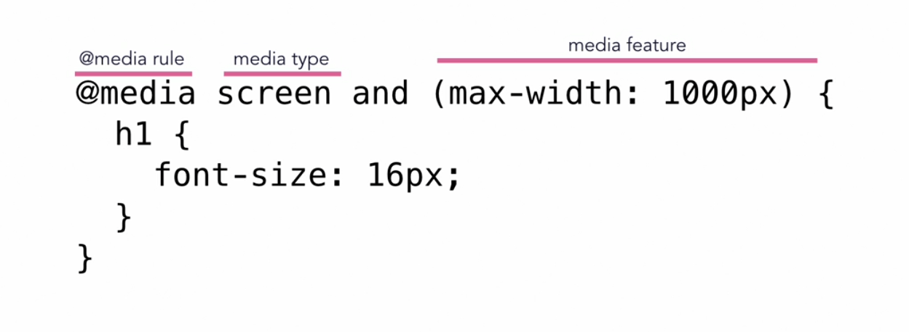

## CSS RESET

```css
/*
SPACING SYSTEM (px)
2 / 4 / 8 / 12 / 16 / 24 / 32 / 48 / 64 / 80 / 96 / 128

FONT SIZE SYSTEM (px)
10 / 12 / 14 / 16 / 18 / 20 / 24 / 30 / 36 / 44 / 52 / 62 / 74 / 86 / 98
*/

* {
  margin: 0;
  padding: 0;
  box-sizing: inherit; 
}

html {
  box-sizing: border-box;
}

```

## Selectors 

### Selector specificity  

(Inline, IDs, Classes, Elements)

Goes through selector and see what it has from left to right. 

(0, 0, 0, 0)

`nav#nav div.pull-right .button {`

`	background-color: green;`

`}` 

has a specificity of (0, 1, 2, 2)

`#nav a.button:hover {`

`	background-color: yellow;`

`}` 

has a specificity of (0, 1, 2, 1). Therefore, the button's background color will be green since it wins out at the elements specificity. 

## Reminders

- a selector that contains 1 ID is more specific than one with 1000 classes
- a selector that contains 1 class is more specific than one with 1000 elements
- The universal selector * has no specificity value (0, 0, 0, 0)
- rely more on specificity than on the order of selectors
  - allows you to rearrange things in the future, thus, scalable 
- But, rely on order when using 3rd-party stylesheets - always put your author stylesheet last. 

## Padding

the parent's width is always the reference for percentage-based calculations  

length w/ em unites uses the current element for computed font-size, reference is current element. 

## Margin

- Use `margin-bottom` for vertical spacing. 

## CSS Value Processing: What You Need To Know

- Browsers specify a root font-size for each page (usually 16px)
- Percentages and relative values are always converted to pixels
- Percentages are measured relative to their parent's font-size, if used to specify font-size
- Percentages are measured relative to their parent's width, if used to specify lengths
- em are measured relative to their parent font-size, if used to specify font-size
- em are measured relative to current font-size, if used to specify lengths 
- rem are always measured relative to the document's root for *font-size*
- vh and vw are simply percentage measurements of the viewport's *height* and *width*

## Inheritance: What You Need To Know

- inheritance passes the values for some specific properties from parents to children - more maintainable code
- properties related to text are inherited: *font-family*, *color*, etc.
- the computed value of a property is what gets inherited, not the declared value
- Inheritance of a property only works if no one declares a value for that property
- The *inherit* keyword forces inheritance on a certain property
- The *initial* keyword resets a property to its initial value

## The Box Model

- Content: text, images, etc.
- Padding: transparent area around the content, inside of the box
- Border: goes around the padding and the content
- Margin: space between boxes;
- Fill Area: area that gets filled with background color or background image

## The Box Model: Heights and Widths

**total width** = right border + right padding + specified width + left padding + left border

**total height** = top border + top padding + specified height + bottom padding + bottom border 

**example**: height = 0 + 20px + 100px + 20px + 0 = 140px

Box-sizing: border-box fixes this by just going by our specified height/width.

## Think, Build, Architect

- Think
  - Layout, Atomic Design
- Build
  - BEM
- Architect
  - The 7-1 Pattern
  - 7 different folders for partial Sass files, and 1 main Sass file to import all other files into a compiled CSS stylesheet. 
    - **base/** (where we put the basic product definitions)
    - **components/** (where we have one file for each component)
    - **layouts/** (where we define the overall layout of the project)
    - **pages/** (where we have styles for specific pages of the project)
    - **themes/** (if you want to implement different visual themes)
    - **abstracts/** (where we put code that doesn't output any CSS, such as variables or mix-ins)
    - **vendors/** (where all third-party CSS goes)

## Normal Flow vs. Absolute Positioning

### Normal Flow

- Default Positioning
- Element is "**in** flow"
- Elements are simply laid out according to their order in the HTML code
- `position: relative`

### Absolute Positioning

- Element is removed from the normal flow: "**out of** flow"
- No impact on surrounding elements, might overlap them
- We use top, bottom, left, or right to offset the element from its relatively positioned container
- `position: absolute`


## BEM: Building with Meaningful Class Names

- Block Element Modifier
  - .block {}
  - .block__element {}
  - .block__element--modifier {}
- **BLOCK:** standalone component that is meaningful on its own. (btn)
- **ELEMENT:** part of a block that has no standalone meaning. (btn-description)
- **MODIFIER:** a different version of a block or an element. (btn-round)

## Node & NPM

- npm init
- npm install node-sass --save-dev
  - in order to save it as a development dependency here in our package .json file. Which means that it's a development tool that will just help us in building our project. 
  - We save it in the package.json file so that we can share our project without sharing the entire node modules
    - then if someone receives the json and does `npm install`, they can download all the necessary files to run our project. 

## SASS (SCSS)

- I will be using SCSS which stands for Sassy CSS, slight different syntax than SASS
- - variables: `$primary-color: #ddd;`
  - mix-ins
  - extends
- SCSS file extension
  - to write SCSS, Sassy CSS, you must use .scss files extensions, not SASS
  - **easy to convert CSS to SCSS because valid CSS is valid SCSS.**
- Compiling SASS
  - to compile sass, add a script to your package.json file.
  - the script looks something like this:
    - `"compile:sass": "node-sass sass/main.scss css/styles.css"`
    - then, run `npm run compile:sass` in your terminal and watch the magic unfold.
    - to explain the script a little bit, the second path is the location to your sass file, and the last is where you want the compile sass to output to.
  - to install live-server: only have to do it once, to run it just type `live-server` in the project home folder terminal. 
    - npm install live-server -g

## REVIEW: Basic Responsive Design Principles

1. Fluid Grids and Layouts

   To allow content to easily adapt to the current viewport width used to browse the website. Uses % rather than px for all layout-related lengths. 

2. Flexible/Responsive Images

   Images behave differently than text content, and so we need to ensure that they also adapt nicely to the current viewport.

3. Media Queries 

   To change styles on certain viewpoint widths

## Layout Types

- Float Layouts 
- Flexbox 
- CSS Grid

## Flexbox


- The main idea behind flexbox is to give the container the ability to expand and to shrink elements to elements to best use all the available space
- Flexbox replaces float layouts, using less, and more readable and logical code
- Flexbox completely changes the way that we build one-dimensional layouts 

## Main Flexbox Concepts

- the element that we use flexbox on is called the flex container 
- all the direct children in a flex container are called flex items
- the direction the flex items are laid out across is called the main axis (going across)
- perpendicular to that is called the cross axis (going down)

## Flexbox Properties Overview

- **Container**
  - **bold items is default value**
  - flex-direction: **row** | row-reverse | column | column-reverse 
    - when `flex-direction` is set to `column`, the flex values will not apply to height instead of width
    - to wrap items in columns, set a height 
  - flex-wrap: **nowrap** | wrap | wrap-reverse 
  - justify-content (main-axis): **flex-start** | flex-end | center | space-between | space-around | space-evenly 
  - align-items (cross-axis): **stretch** | flex-start | flex-end | center | baseline
  - align-content: **stretch** | flex-start | flex-end | center | space-between | space-around
    - only applies when there is more than one row of flex items
    - controls how the rows are align along the cross axis if there is some empty space
- **Item**
  - align-self: similar to align-items, but for one individual flex item 
  - order: defines the order in which one specific flex item should appear
  - flex-grow: how much an item can grow
    - determines how items will expand if there is extra space in the container
    - if there is extra space, the items in that row will evenly take up the available space 
  - flex-shrink: how much it can shrink
    - determines how items will shrink if there isn't enough space in the container 
  - flex-basis : it's basically the width property for flex-items
    - it sets the initial size of the flex-items if there is enough space.
    - if not, then shrink or grow according to flex-grow or flex-shrink values
  - flex-shrink: 1 (The flex-item is allowed to shrink as the viewport shrinks)
  - flex-shrink: 0 (The flex-item is not allowed to shrink down is there is extra space)
  - flex-grow: 1 (allows element to take up as much space as it can)
  - flex-grow: 0 (does not allow element to grow)
  - flex: flex-grow flex-shrink flex-basis


## Flex Shorthand 

```css
/* flex: flex-grow-value flex-shrink-value flex-basis-value; */

flex: 0 1 100px;
flex: 1 0 40%;
flex: 2 2 auto;
```

> IMPORTANT REALIZATION: Ok, so this flex shorthand is placed on your flex items. flex works like this: flex-grow is saying, "hey, if there is extra space, let me increase my size." Flex-shrink is saying how it's ok to shrink my size if the viewport becomes less than my ideal size(flex-basis). Flex-basis is the INITIAL size of your flex-item and can grow or shrink accordingly to your aforementioned values. If your container is `900px` and you have a 3 flex items with a flex-basis of 200px, 500px, and 200px respectively, then when the container's width becomes smaller than `900px` the last flex item will wrap to the next line because the container does not have enough room for that last flex items width (flex-basis) if that item has flex-shrink set to 0.

### Adding margins to Flexbox Items

```css
.flex-item {
/* have to account for both sides for margin */
width: calc(33.333333% - 20px);
margin: 10px;
}
```


Responsive Images

- To make responsive images, format the img element. 
  - always declare a width and height in percentages so that the image is fluid.
  - image should be displayed as block, so that there is no small space beneath image.

### Adding Space Between Columns with Flexbox

- Use the combinator operator to select if an element has an adjacent sibling of `.col` then it will select it. 

  ```css
  .col + .col {
  	margin-left: 30px;
  }
  ```

- Or use Wes Bos Calc function

  ```
  .col {
  	margin: 0 10px;
  	flex: 1 1 calc(33.33% - 20px);
  }
  ```

  


## CSS Grid

- CSS Grid replaces float layouts, using less, and more readable and logical CSS and HTML
- Most commonly used with 12-column layout - very versatile for responsive design
- CSS Grid works perfectly together with Flexbox, which is best to handle one-dimensional components and layouts 
- CSS Grid completely changes the way that we envision and build two-dimensional layouts 


### CSS Grid Firefox Dev Tools - Line Meanings


- Explicit tracks are the ones we created, the one we defined with `grid-template-columns/rows`
- Implicit tracks were created by the browser

## minmax()

```css
/* sets row height to 100px */
grid-column-rows: 100px;

/* sets minimum row height to 100px, max height to auto, meaning if the content is longer, it will expand to fit */
grid-column-rows: minmax(100px, auto);

/* one row set to a min and max height value */
grid-column-rows: minmax(100px, auto);

/* two rows height set to a min and max height value */
grid-column-rows: repeat(2, minmax(100px, auto));
```


## THE CALC FUNCTION TO THE RESCUE 

- use calc(100vh - whatever height of navbar to make a complete 100vh experience for landing page.
- ex: calc (100vh - 6 rem)

### Responsive Typography

`font-size: calc(Xvw + Yem)`
- X and Y = two numbers. 
- Example: calc(0.5vw + 1em); The cool thing is, you can easily control 'how responsive' the text will be.

## Consistent Margins with Type

- for consistency, often we "turn off" the margin-top on typography related elements.
- That way we can use padding on the parent, and know the exact spacing that we'll have, and can keep all sides consistent.

## In-line & Block elements

#### Block Elements

Block level elements will create a new line of content, stacking on top of each other by default.

default width: 100%

default height: 0, but will grow to the height according to the content in them.

- paragraphs
- headings
- lists and list items
- div
- header
- footer
- main
- section
- etc.

#### Inline elements

Inline elements stay within the flow of what's around them.

- links
- strong
- em
- span
- Images (sort of)

There are some important things to know about inline elements:

- you can only nest other inline elements in them (such as putting a link inside a strong element) (you cannot put a div inside a span element)
- They will only respect margin, padding, and borders which are placed on the left or the right side, and not the top and bottom.
  - you CANNOT set a width or a height on an inline element

## The Span Element

There is a very useful inline element, called a span

- the span element is like strong and em, in that we use it to style text, but it has no default styling and no semantic meaning
- a span by itself is a little useless, normally we use a class on them to make it easy to target with class

## Styling Links

Links have different "states" that we can style as well

- default "link" state

  `a { color: yellow;}`

- Visited Links
- Focus (navigating a website by keyboard)
- Hover
- Active (the style while you're actively clicking on the link)

We can target these different states by using something called a pseudo-class

- a: link
- a:visited
- etc. 

Important to note specificity of a:psudo classes selectors. For instance, an active pseudo class will not work if above a:link. 

```
a:link,
a:visited {
  color: #FFE600;
}

a:focus {
  color: aquamarine;
}

a:hover {
  color: firebrick;
}

a:active {
  color: plum;
}
```

**if you do**

`a:hover { color: aqua; }`

**it controls all of your link states**

BEST PRACTICE

```css
.btn:link,
.btn:visited {
    color: green;
}

.btn:hover,
.btn: active {
    color: lighter green;
}
```


Finally, make sure to always include styles for :focus, it can be added to the hover pseudo class.

## Inline-block

Sometimes we need something which can stay inline, but which we can set margins and padding on.

`display: inline-block`

Mostly used for buttons.

### CSS Units

#### Absolute 

- pixels 

#### Percentages 

- When using percentages, that percentage is always relative to its parent. 
  
- A lot of the time, that parent is going to default to 100%
  
- responsive images: 

  `set width to 100%`

## Max & Min Width

- max-width
  - set to keep container size at a set size while on big screens, but allows the content to shrink in smaller screens
- min-width
  - minimum width were the container will never shrink below the smallest size
- max/min width are different values than width

## How to decide which CSS unit to use

General rule of thumb:

- Font-size = rem
- padding and margin = em
- Widths = em or percentage

## Media Queries

Media queries let us add new styles that target only specific conditions

`@media rule media-type and (media-features) {...}`



- The media-type let's us target different types of media
  - All `@media all {...}`
    - all: matches to all devices
  - Screen `@media screen {...}`
  - matches all devices that aren't categorized as print or speech
  - Print `@media print {...}`
    - matches to printers and print-related displays such as removing the background-color so your design doesn't use up your user's ink
  - Speech `@media speech {...}`
    - matches to screen reading devices that "read out" a page
  - with a media type defined, the media query defaults to `all`
  
- The media condition let's us target specific conditions within that media type
  - Widths `@media (min-width: 600px) {...}`
  - Orientation `@media (orientation: landscape) {...}`
  - Specific features `@media (hover) {...}`
  
- Both media types and conditions are optional

- We do need to either have a type or condition though

- For example, we can target only screens
  
  - `@media screen {...}`
  
-  You can combine a type with a condition by using and:
  
  - `@media screen and (min-width: 960px) {...}`
  
- Media queries are usually defined at the bottom of your main CSS file, or you can use `@import` to load the stylesheet into the main CSS file

  `@import url("mobile.css") screen and (max-width: 480px);`

- Or, you can use `<link>` to load the stylesheet into the HTML file 

`<link rel="stylesheet" media="screen and (max-width: 480px)" href="mobile.css">`

## Breakpoints

- 320px: Mobile portrait
- 480px: Mobile landscape
- 600px: Small tablet
- 768px: Tablet portrait
- 940 - 1024px: Tablet landscape
- 1280px and greater: Desktop, laptop

> With the rise of the number of devices available, it's hard to pinpoint what is even considered what is a common size anymore. So rather than focusing on specific devices, it's better to focus on where the design and layout needs adjusting.

## Width Media Feature

When using the Width Media Feature, the media query test applies to the width of the browser's viewport.

```css
/* Exact width */
@media (width: 360px) {...}

/* Minimum width - 360px or larger */
@media (min-width: 360px) {...}

/* Maximum width - 360px or smaller */
@media (max-width: 360px) {...}
```

Using the min or max value works better than just width because it specifies a range such as larger than or smaller than. If we use width alone, then it only applies if the viewport is exactly equal to the defined value.

A simple solution:

```css
/* 800px and larger */
@media (min-width: 800px) {...}
/* 799px and smaller */
@media (max-width: 799px) {...}

/* OR */

/* 801px and larger */
@media (min-width: 801px) {...}
/* 800px and smaller */
@media (max-width: 800px) {...}
```

## Desktop First

Usually uses `max-width` media queries

```css
/* Optimized for larger screens */
body {...}
/* Changes made for smaller screens */
@media (max-width: 800px) {
	body {...}
}
@media (max-width: 400px) {
    body {...}
}
```

## Mobile First

The designs in CSS cater to smaller sizes first. This approach usually uses `min-width` media queries. 

```css
/* Optimized for larger screens */
body {...}
/* Changes made for larger screens */
@media (min-width: 800px) {
	body {...}
}
@media (min-width: 1200px) {
    body {...}
}
```

You can also combine min and max to create a range.

```css
/* This applies a range of 400px to 800px */
@media (min-width: 400px) and (max-width: 800px) {
	body {...}
}
```

## min-and max-width Breakpoints

Sometimes, when you use min-width and max-width values, you may end up targeting the same resolution.

## Position: Relative vs. Absolute

- `position: relative;` property keeps things in the normal flow. Movement with offset properties (top, bottom, left, right) are based on the original element's position
- `position: absolute;` property moves the element out of the page's normal flow. It's like it is on its own layer. 
  - to move it up or down a "layer," use change the  `z-index` property
- By default, elements are positioned relative to the body.
  - to position along a certain area, add `position: relative` to a containing element - the parent element.

### Vertical Centering with Absolute Positioning and Transform


## Creating a fixed navigation bar

```css
nav {
    /* position sticky and top property allows the nav to stay at the top of the viewport */
    position: sticky;
    top: 0;
    
    /* a high z-index means that the navbar will always be on top */
    z-index: 100;
    
    /* with no set width, the navbar will be the width of its content */
    width: 100%;
    
    
}
```

## Responsive Web Design (RWD)

1. Fluid Layout
2. Flexible Images
3. Media Queries

Websites are responsive by default:

`width: 100%` && `height: 100%`

It's us who within our own css styles take away the responsiveness. Anytime we run into an issue, it's us that did something in CSS that took away its responsiveness. 

Therefore, to keep content responsive, never use fixed-widths. Consider using percentages for widths instead.

## Fluid Layout

- instead of fixed-width pixels, use percentage-based values with min and max properties to create a flexible foundation

```css
/* 
When the viewport is wider than the max-width, the content wrap maxes out at the defined value, but when the viewport is smaller than the max-width, it becomes the same width as its container (if a width is not defined).

When the viewport is smaller than the max-width value, it will apply the width value (85%), thus, leaving some spaced around the content instead of the content sticking to the edges of the container at 100% width.
*/
.container {
    max-width: 800px;
    width: 85%;
}
```

- While fluid layouts may not solve everything, starting with flexible CSS will set the foundation for optimizing the layout for different screen sizes rather than relying solely on media queries. 

## Images

- Images that are part of the content should be added with HTML

  `img src="images/project-courses.jpg" alt="course thumbnail">`

- Images that are presentational should be added with CSS

  ```css
  section {
  	background-image: url(path/to/image);
  }
  ```

- In an actual project, image sizes should match the dimensions of the area it's being applied to.