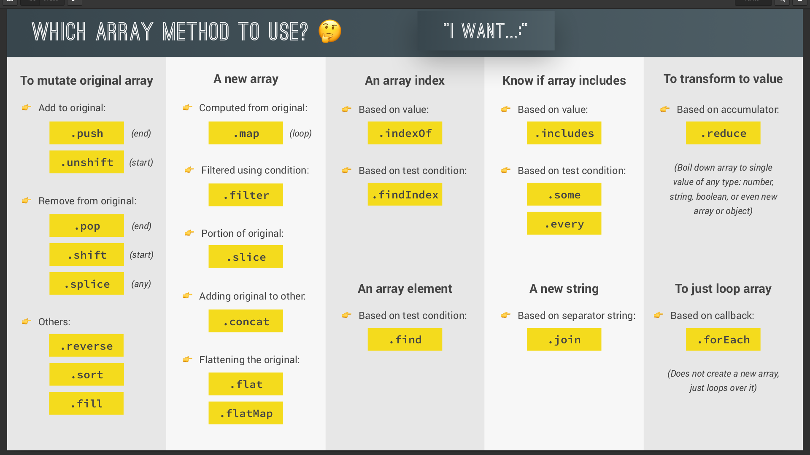

# JavaScript Notes

*JavaScript is a high-level, prototype-based, object-oriented, multi-paradigm, interpreted or just-in-time compiled, dynamic, single-threaded, garbage-collected programming language with first-class functions and a non-blocking event loop concurrency model.*

## Paradigms

- An approach and mindset of structuring code, which will direct your coding style and technique
1. Procedural programming
   - very simple, linear way to organize code with some functions
2. Object-oriented programming
3. Functional programming

## Primitive vs. Objects

- Primitive values cannot be changed - they are immutable, unchangeable, READ-ONLY
- **Variables are not values.**
  - thus, they can be changed.
- **Variables always point to values.**
  - primitive values cannot be changed.
  - we can change which value it points to by using the = assignment operator.

- You cannot pass a variable in JavaScript.

- ### Primitive values

  - undefined (undefined), used for unintentionally missing values
  - Null(null), used for intentionally missing values
  - Booleans (true and false), used for logical operations
  - Numbers (-100. 3.14, and other), used for math calculations
  - Strings ('hello', 'abracadabra'), used for text
  - Symbols (uncommon), used to hide implementation details
  - BigInts (uncommon and new), used for math on big numbers

- ### Objects and functions

  - Objects used to group related data and code
  - Functions used to refer to code

## First-Class Functions

In a language with **first-class functions**, functions are simply treated as **variables**. We can pass them into other functions, and return them from functions.

- i.e. passing a function into another function as an argument: First-class functions!
- functions are just another type of object

## Functions

- in javascript, we pass only by value. NOT REFERENCE

## The Concurrency Model

- how the JavaScript engine handles multiple tasks happening at the same time 
  - Why do we need that? 
- JavaScript runs in one **single thread**, so it can only do one thing at a time.
  - So what about a long-running task?
- Sounds like it would block the single thread. However, we want non-blocking behavior! 
  - How do we achieve that? 
- By using an **event loop**: takes long-running tasks, executes them in the "background", and puts them back in the  main thread once they are finished. 

## Hoisting in JavaScript

"Variables lifted to the top of their scope". Really, hoisting means: before execution, code is scanned for variable declarations, and for each variable, a new property is created in the variable enviornment object.

- Hoisting in JavaScript, with the `var` data type means JavaScript will declare variables first, and then give them a value later. 
  - So, to avoid weird issues, declare your variables before you use them
- With `let` and `const`, JavaScript does not hoist these
- Function statements and function declarations are hoisted.
  - Function expressions are not hoisted, treated as a let/const variable

## The Conditional (Ternary) Operator

The conditional operator, also called the ternary operator, can be used as a one line if-else expression.

The syntax is:

```javascript
condition ? statement-if-true : statement-if-false;
```

The following function uses an if-else statement to check a condition:

```js
function findGreater(a, b) {
  if(a > b) {
    return "a is greater";
  }
  else {
    return "b is greater";
  }
}
```

This can be re-written using the `conditional operator`:

```js
function findGreater(a, b) {
  return a > b ? "a is greater" : "b is greater";
}
```

## Closures

Closures are the ability for an inner function to access variables from a higher level scope even after the functions have been called or closed over. 

## Event Listeners

> Go get something, listen for something, then go do something.

```js
btn.addEventListener('click', function() {
   console.log('IT GOT CLICKED!!!'); 
});
```

## Object Reference vs Values

Objects & arrays are copied by ***reference***. 

```js
const person1 = {
    first: 'chris',
    last: 'mendez'
};
const person2 = {
    first: 'chris',
    last: 'mendez'
}

const person3 = person1;
```

**Reference** - we are not taking a copy, we are simply creating a variable that references / points to the original variable instead of making a copy of it. person3 was never its own object, it just points to the original object. 

### How to "Shallow" Copy an Object

- only copies one level deep.

```javascript
const person1 = {
    first: 'chris',
    last: 'mendez'
};
const person2 = {
    first: 'chris',
    last: 'mendez'
}

// use the spread operator - it spreads (like a knife) the contents from the person1 object into the new person3 object
const person3 = { ...person1 };
```

## Functional Programming

Two distinct principles for functional programming: 

1) Don't alter a variable or object - create new variables and objects and return them if need be from a function.

2) Declare function arguments - any computation inside a function  depends only on the arguments, and not on any global object or variable.

## Arrays

- Some methods will mutate (modify) the original array and others will leave the original array intact. 
- anytime you want to use a mutation method and NOT mutate the original array, we need to take a copy of the array using the spread operator

```javascript
const numbersReversed = [...numbers].reverse();
```

- **slice()** *does not* mutate the original array
- **splice()** *will* mutate the original array

Using an arrow function shorthand and want to return an object literal? Remember to wrap your object literal in parenthesis! 

```javascript
const ratings = watchList.map(movie => ({title: movie.Title, rating: movie.imdbRating}));
```

If you don't include parenthesis, then JavaScript looks at the brackets and thinks you're just using a regular function block.



### Array Methods

- `pop()` method removes the last element from an array 
- `shift()` method removes the first array element and "shifts" all other elements to a lower index
- `push()` method adds a new element to an array (at the end) 
- `unshift()` method adds a new element to an array (at the beginning)
- `splice()` method can be used to add or delete elements from an array 
  - (defines the position where new elements should be added, defines how many elements should be removed, rest of the parameters are the elements you want to add (or leave blank to delete elements from an array))
- `concat()` method creates a new array by merging existing arrays

### Nested For Loops

A nested for loop for creating a 2D array is like the formula for finding the area of a 2D shape: 

`area = length * width`

## What is the DOM?

**DOCUMENT OBJECT MODEL**: Structured representation of HTML documents. Allows JavaScript to access HTML elements and styles to manipulate them (change text, HTML attributes, and even CSS styles).

- Anything that has to be in the HTML document also has to be in the DOM tree. Thus, accessible with JavaScript.

- DOM !== JAVASCRIPT

DOM Methods and Properties for DOM Manipulation are apart of WEB APIs - libraries that browsers implement and that we can interact through JavaScript code.
